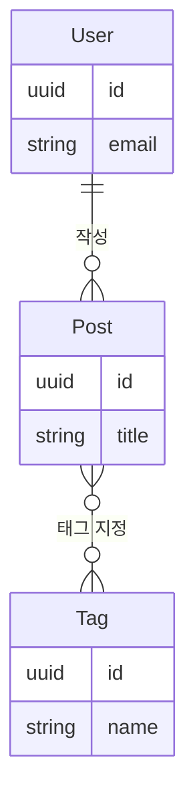
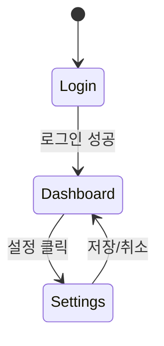
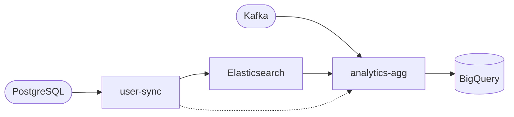

# Generation Rules — SDwC v1

> 이 문서는 Template Engine이 intake_data.yaml과 템플릿(CLAUDE_BASE.md, doc-templates/, skill-templates/)을 결합하여 최종 산출물을 생성할 때 적용하는 **모든 치환·생성 규칙**을 정의합니다.

---

## 1. 개요

### 1.1 적용 범위

이 문서의 규칙은 Template Engine의 전체 렌더링 파이프라인에 적용됩니다.

```
intake_data.yaml
     ↓
[1. 컨텍스트 구성] → §2
     ↓
[2. Jinja2 렌더링] → §3~§7
     ↓
[3. Post-processing] → §11
     ↓
[4. 서버 리소스 복사] → §9.5
     ↓
[5. 파일 출력] → §9
```

### 1.2 입력 리소스

| 리소스 | 설명 |
|--------|------|
| intake_data.yaml | 사용자가 값을 채운 설문 데이터 |
| CLAUDE_BASE.md | CLAUDE.md 생성용 Jinja2 템플릿 |
| doc-templates/ | docs/ 생성용 Jinja2 템플릿 17개 |
| skill-templates/ | skills/ 생성용 템플릿 (common/ + per-framework/) |

### 1.3 출력 산출물

| 산출물 | 소스 |
|--------|------|
| CLAUDE.md | CLAUDE_BASE.md + intake_data |
| docs/common/*.md | doc-templates/common/ + intake_data |
| docs/{service-name}/*.md | doc-templates/{service-type}/ + 서비스 객체 |
| skills/common/*.md | skill-templates/common/ + intake_data |
| skills/{service-name}/*.md | skill-templates/per-framework/{framework}/ + 서비스 객체 |
| .sdwc/ | 서버 리소스 원본 (렌더링 없이 단순 복사) |

---

## 2. 렌더링 컨텍스트 규칙

Template Engine은 템플릿 종류에 따라 서로 다른 **루트 컨텍스트**를 주입합니다.

### 2.1 컨텍스트 종류 (3가지)

| 컨텍스트 | 루트 데이터 | 적용 대상 |
|----------|-----------|----------|
| **Global** | intake_data 전체 | CLAUDE_BASE.md, doc-templates/common/, skill-templates/common/ |
| **Service** | `services[i]` 단일 서비스 객체 | doc-templates/{service-type}/, skill-templates/per-framework/ |
| **Service + Global** | 서비스 객체 + 최상위 필드 병합 | 해당 없음 (현재 미사용, 확장 예약) |

### 2.2 Global 컨텍스트

intake_data.yaml의 **최상위 구조가 그대로** 루트가 됩니다.

```yaml
# intake_data.yaml
project:
  name: "MyApp"
services:
  - name: "my-api"
    type: "backend_api"
    ...
```

템플릿에서의 접근:

```jinja2
{{ project.name }}           → "MyApp"

  {{ svc.name }}            → "my-api"

```

**적용 대상:**
- `CLAUDE_BASE.md` → `CLAUDE.md`
- `doc-templates/common/*.md` → `docs/common/*.md`
- `skill-templates/common/*.md` → `skills/common/*.md`

### 2.3 Service 컨텍스트

`services[]` 배열의 **개별 서비스 객체**가 루트가 됩니다.
서비스 타입별 doc-template과 skill-template에 적용됩니다.

```yaml
# intake_data.yaml → services[0]
- name: "my-api"
  type: "backend_api"
  databases:
    - engine: "postgresql"
      role: "primary"
```

템플릿에서의 접근:

```jinja2
{{ name }}                   → "my-api"    (접두사 없음)
{{ type }}                   → "backend_api"

  {{ db.engine }}          → "postgresql"

```

**핵심 원칙**: 서비스 템플릿에서는 `services[i].` 접두사가 없습니다. `{{ databases }}`로 바로 접근합니다.

**적용 대상:**
- `doc-templates/backend_api/*.md` → `docs/{service-name}/*.md`
- `doc-templates/web_ui/*.md` → `docs/{service-name}/*.md`
- `doc-templates/worker/*.md` → `docs/{service-name}/*.md`
- `doc-templates/mobile_app/*.md` → `docs/{service-name}/*.md`
- `doc-templates/data_pipeline/*.md` → `docs/{service-name}/*.md`
- `skill-templates/per-framework/{framework}/*.md` → `skills/{service-name}/*.md`

### 2.4 렌더링 반복 규칙

서비스 템플릿은 **`services[]` 배열의 각 항목마다 1회** 렌더링됩니다.

```
services = [my-api (backend_api), my-frontend (web_ui)]

→ my-api: doc-templates/backend_api/ 의 모든 파일 렌더링 (Service 컨텍스트: services[0])
→ my-frontend: doc-templates/web_ui/ 의 모든 파일 렌더링 (Service 컨텍스트: services[1])
```

서비스가 2개면 서비스 템플릿은 총 2회 렌더링되고, 결과는 각각 `docs/my-api/`, `docs/my-frontend/`에 출력됩니다.

---

## 3. 변수 매핑 규칙

### 3.1 기본 원칙 — 경로 직접 매핑

intake_data.yaml의 YAML 경로와 Jinja2 변수 경로는 **1:1로 일치**합니다.

| 컨텍스트 | intake 경로 | Jinja2 변수 |
|----------|-----------|-----------------|
| Global | `project.name` | `{{ project.name }}` |
| Global | `services[i].name` | `{{ svc.name }}` |
| Global | `testing.levels[i].framework` | `{{ level.framework }}` |
| Service | `services[i].databases[j].engine` | `{{ db.engine }}` |

**규칙**: 별도 매핑 테이블이 필요 없습니다. intake의 YAML 경로가 곧 Jinja2 경로입니다. Service 컨텍스트에서는 `services[i].` 접두사만 제거합니다.

### 3.2 예외 — Template Engine 생성 변수

아래 변수들은 intake_data에 존재하지 않으며, **Template Engine이 intake 데이터를 기반으로 계산/생성**합니다.

| 변수 | 사용 위치 | 생성 방법 | 상세 규칙 |
|------|----------|----------|----------|
| `{{ adr_seq() }}` | 02-architecture-decisions | 순차 채번 카운터 | §6 |
| `{{ mermaid_erd }}` | 20-data-design | `entities[]` + `relationships[]` → Mermaid erDiagram | §7.1 |
| `{{ mermaid_page_flow }}` | 30-ui-design | `page_transitions[]` → Mermaid stateDiagram | §7.2 |
| `{{ mermaid_screen_flow }}` | 50-mobile-design | `screen_transitions[]` → Mermaid stateDiagram | §7.3 |
| `{{ mermaid_data_lineage }}` | 60-pipeline-design | `pipelines[]` + `pipeline_dependencies[]` → Mermaid flowchart | §7.4 |
| `{{ loop.index }}` | 21-api-contract, 40-worker-design, 60-pipeline-design | Jinja2 네이티브 1-based 인덱스 | — |

### 3.3 부모 컨텍스트 참조

중첩된 `` 블록 내에서 상위 루프의 값을 참조할 때 `{{ framew_i.field }}`를 사용합니다.

사용 위치: `02-architecture-decisions`의 서비스 간 통신 테이블

```jinja2


| {{ svc.name }} | {{ commun_i.target }} | {{ commun_i.protocol }} | {{ commun_i.sync_async }} |


```

여기서 `{{ svc.name }}`은 외부 루프(`services`)의 루프 변수를 내부 루프에서 직접 참조합니다. Jinja2에서는 외부 루프 변수를 별도 문법 없이 이름으로 접근할 수 있습니다.

---

## 4. 조건부 블록 평가 규칙

### 4.1 `` — 존재 여부 조건

**평가 기준**: 값이 truthy이면 블록을 렌더링하고, falsy이면 건너뜁니다.

```jinja2

> 코드네임: {{ project.codename }}

```

Truthy/Falsy 판정은 §10에서 정의합니다.

### 4.2 `` — 등가 비교 조건

**평가 기준**: 첫 번째 인자와 두 번째 인자가 **문자열 완전 일치**하면 블록을 렌더링합니다.

```jinja2

  ...REST 전용 섹션...



  ...스크럼 전용 섹션...

```

**CRITICAL enum 연동**: intake_template.yaml에서 `⚠️ used for template branching`으로 표시된 4개 enum이 ``의 비교 대상입니다.

| 필드 | 사용 위치 | 허용 값 |
|------|----------|--------|
| `services[i].api_style` | 21-api-contract §4 | `rest`, `graphql`, `grpc` |
| `workers[i].trigger_type` | 40-worker-design §2 | `queue`, `cron`, `event`, `webhook` |
| `collaboration.per_service[i].mode` | CLAUDE_BASE.md §2, §5 | `autonomous`, `collaborative`, `learning` |
| `process.methodology` | CLAUDE_BASE.md §5.9 | `scrum`, `kanban`, `scrumban`, `xp` |

**주의**: ``의 비교 값은 intake_template.yaml의 `# values:` 주석에 정의된 값과 **정확히 일치**해야 합니다. 대소문자 구분합니다.

### 4.3 `` — 배열 순회

배열의 각 항목에 대해 블록을 반복 렌더링합니다.

```jinja2

| {{ svc.name }} | {{ svc.type }} | {{ svc.responsibility }} |

```

**빈 배열 처리**: 빈 배열(`[]`)이면 블록을 건너뜁니다 (§10 참조).

**중첩 루프**: `` 안에 ``를 사용할 수 있습니다. 내부 루프에서 외부 루프의 값은 `{{ framew_i.field }}`로 접근합니다 (§3.3 참조).

### 4.4 `` — 부정 조건

``의 반대입니다. 값이 falsy일 때 블록을 렌더링합니다.

예시: 서비스 목록을 쉼표로 구분하여 나열

```jinja2
{{ svc.name }}({{ svc.type }}), 
```

`{{ loop.last }}`는 Jinja2 내장 변수로, 현재 항목이 배열의 마지막이면 `true`입니다.

---

## 5. 커스텀 함수

Jinja2 전환 후 커스텀 함수는 `adr_seq()` **1개만** 필요합니다. Handlebars 시절의 `if_eq`와 `index_1`은 Jinja2 네이티브 기능으로 대체되었습니다.

### 5.1 Handlebars 헬퍼 → Jinja2 대체

| 구 헬퍼 (Handlebars) | Jinja2 대체 | 비고 |
|----------------------|------------|------|
| `if_eq(field, value)` | `` | 네이티브 등가 비교 |
| `index_1` | `{{ loop.index }}` | 네이티브 1-based 인덱스 |

### 5.2 `adr_seq()` — ADR 순차 채번

유일한 커스텀 함수입니다. Template Engine이 Jinja2 환경에 전역 함수로 등록해야 합니다.

상세 규칙(채번 순서, 조건부 건너뛰기, 구현)은 §6을 참조합니다.

---

## 6. ADR 채번 규칙

### 6.1 개요

`02-architecture-decisions.md`의 ADR(Architecture Decision Record)은 **순차 번호**로 채번됩니다. 템플릿에서 `{{ adr_seq() }}`로 표기된 위치마다 Template Engine이 1부터 시작하는 연속 번호를 부여합니다.

### 6.2 채번 순서

Template Engine은 템플릿을 **위에서 아래로** 순회하면서 `{{ adr_seq() }}`를 만날 때마다 카운터를 1 증가시킵니다.

현재 02-architecture-decisions.md의 ADR 생성 순서:

```
ADR-1: 아키텍처 패턴          ← architecture.pattern (항상 생성)

→ services[] 순회 시작 (i = 0, 1, 2, ...)

ADR-N: {service.name} 기술 스택   ← 서비스마다 항상 생성
ADR-N: {service.name} 데이터베이스 ← service.databases가 있을 때만 생성
ADR-N: {service.name} 배포 방식   ← 서비스마다 항상 생성

→ services[] 순회 종료
```

### 6.3 조건부 ADR의 번호 건너뛰기 없음

데이터베이스 ADR은 `` 조건 내에 있습니다. 해당 서비스에 DB가 없으면 이 ADR은 **건너뛰고**, 다음 ADR이 바로 이어서 채번됩니다. 번호에 빈 자리가 생기지 않습니다.

### 6.4 예시

2개 서비스: `my-api` (backend_api, DB 있음) + `my-frontend` (web_ui, DB 없음)

| ADR # | 제목 |
|-------|------|
| ADR-1 | 아키텍처 패턴 |
| ADR-2 | my-api 기술 스택 |
| ADR-3 | my-api 데이터베이스 |
| ADR-4 | my-api 배포 방식 |
| ADR-5 | my-frontend 기술 스택 |
| ADR-6 | my-frontend 배포 방식 |

`my-frontend`에 DB가 없으므로 "my-frontend 데이터베이스" ADR은 생성되지 않고, 배포 방식이 ADR-6으로 바로 이어집니다.

### 6.5 구현

```python
adr_counter = 0

def next_adr_seq():
    global adr_counter
    adr_counter += 1
    return adr_counter
```

Template Engine은 `{{ adr_seq() }}`를 만날 때마다 `next_adr_seq()`를 호출합니다. 조건부 블록(``)이 false로 평가되면 블록 내의 `{{ adr_seq() }}`는 호출되지 않으므로 자연스럽게 건너뛰어집니다.

---

## 7. Mermaid 다이어그램 생성 규칙

Template Engine은 intake 데이터를 기반으로 4종의 Mermaid 다이어그램을 생성합니다. 각 다이어그램은 서비스 템플릿(Service 컨텍스트)에서 사용됩니다.

### 7.1 `{{ mermaid_erd }}` — 엔티티 관계 다이어그램

**사용 위치**: `20-data-design.md` §2
**소스 데이터**: `entities[]`, `entities[].relationships[]`
**Mermaid 종류**: `erDiagram`
**생성 조건**: `entities` 배열이 truthy일 때 (§10 falsy 규칙 적용)

#### 변환 규칙

**엔티티 선언**: `entities[].name`을 엔티티 이름으로 사용합니다.

**관계 표기**: `entities[].relationships[].cardinality`를 Mermaid ER 관계 표기로 변환합니다.

| intake cardinality | Mermaid 표기 | 의미 |
|-------------------|-------------|------|
| `1:1` | `\|\|--\|\|` | 정확히 하나 대 하나 |
| `1:N` | `\|\|--o{` | 하나 대 다수 (0 이상) |
| `N:M` | `}o--o{` | 다수 대 다수 |

**관계 레이블**: `relationships[].description`을 관계 레이블로 사용합니다.

#### 예시

**intake 데이터:**

```yaml
entities:
  - name: "User"
    key_attributes:
      - name: "id"
        type: "uuid"
      - name: "email"
        type: "string"
    relationships:
      - target: "Post"
        cardinality: "1:N"
        description: "작성"
  - name: "Post"
    key_attributes:
      - name: "id"
        type: "uuid"
      - name: "title"
        type: "string"
    relationships:
      - target: "Tag"
        cardinality: "N:M"
        description: "태그 지정"
  - name: "Tag"
    key_attributes:
      - name: "id"
        type: "uuid"
      - name: "name"
        type: "string"
```

**생성 결과:**

````markdown

````

#### 세부 규칙

- **속성 표기**: `key_attributes[].type` + `key_attributes[].name` 형식 (`uuid id`)
- **nullable 표기**: Mermaid erDiagram은 nullable을 직접 표현하지 않음. 속성 목록에 포함하되 nullable 마킹은 생략
- **양방향 관계**: 중복 판정을 하지 않음. `entities[].relationships[]`에 정의된 관계를 모두 렌더링. 동일 엔티티 쌍이라도 의미가 다른 관계(예: "작성"과 "최종수정자")가 존재할 수 있으므로, Template Engine이 임의로 제거하지 않음

> **⚠️ intake_template.yaml 가이드 추가 필요**: `entities[].relationships` 주석에 "관계는 한쪽에서만 정의하세요 (예: User→Post를 정의했으면 Post→User는 생략)"를 추가해야 합니다.

### 7.2 `{{ mermaid_page_flow }}` — 페이지 흐름도

**사용 위치**: `30-ui-design.md` §2
**소스 데이터**: `pages[]`, `page_transitions[]`
**Mermaid 종류**: `stateDiagram-v2`
**생성 조건**: `page_transitions` 배열이 truthy일 때

#### 변환 규칙

- **상태(state)**: `pages[].name`을 상태 이름으로 사용
- **전이(transition)**: `page_transitions[]`의 `from` → `to`를 화살표로, `condition`을 레이블로 사용
- **시작점**: `page_transitions[]`에서 `from`으로만 등장하고 `to`로는 등장하지 않는 페이지를 진입점(`[*]`)으로 설정. 후보가 여러 개면 `pages[]` 배열에서 인덱스가 가장 작은 것을 선택

#### 예시

**intake 데이터:**

```yaml
pages:
  - name: "Login"
    purpose: "사용자 로그인"
  - name: "Dashboard"
    purpose: "메인 대시보드"
  - name: "Settings"
    purpose: "설정 관리"
page_transitions:
  - from: "Login"
    to: "Dashboard"
    condition: "로그인 성공"
  - from: "Dashboard"
    to: "Settings"
    condition: "설정 클릭"
  - from: "Settings"
    to: "Dashboard"
    condition: "저장/취소"
```

**생성 결과:**

````markdown

````

### 7.3 `{{ mermaid_screen_flow }}` — 화면 흐름도 (모바일)

**사용 위치**: `50-mobile-design.md` §2
**소스 데이터**: `screens[]`, `screen_transitions[]`
**Mermaid 종류**: `stateDiagram-v2`
**생성 조건**: `screen_transitions` 배열이 truthy일 때

변환 규칙은 §7.2 `mermaid_page_flow`와 **동일**합니다.
`pages` → `screens`, `page_transitions` → `screen_transitions`으로 대체합니다.

### 7.4 `{{ mermaid_data_lineage }}` — 데이터 리니지

**사용 위치**: `60-pipeline-design.md` §3
**소스 데이터**: `pipelines[].sources[]`, `pipelines[].sinks[]`, `pipeline_dependencies[]`
**Mermaid 종류**: `flowchart LR`
**생성 조건**: `pipelines` 배열이 truthy일 때

#### 변환 규칙

**노드 종류 (4가지):**

| 종류 | 조건 | Mermaid 형태 | 표기 |
|------|------|-------------|------|
| 외부 소스 전용 | 소스로만 등장하는 시스템 | 둥근 사각형 | `id([system])` |
| 싱크 전용 | 싱크로만 등장하는 시스템 | 원통형 | `id[(system)]` |
| 소스이자 싱크 | 양쪽 모두 등장하는 시스템 | 일반 사각형 | `id[system]` |
| 파이프라인 | `pipelines[i].name` | 사각형 | `pipe_name[name]` |

**노드 유형 결정 로직:**

```
1. 전체 pipelines[]를 순회하여 각 system이 소스/싱크 중 어디에 등장하는지 집계
2. 소스로만 등장 → 둥근 사각형 ([system])
3. 싱크로만 등장 → 원통형 [(system)]
4. 소스이자 싱크 → 일반 사각형 [system]
5. 파이프라인 → 항상 사각형 [name]
```

**노드 ID 생성**: 공백과 특수문자를 `_`로 치환하여 유효한 Mermaid ID를 생성합니다.

**연결:**
- 소스 → 파이프라인: `src_system --> pipe_name`
- 파이프라인 → 싱크: `pipe_name --> sink_system`
- 파이프라인 간 의존: `pipeline_dependencies[]`의 `depends_on` → `pipeline`

**중복 노드 방지**: 같은 `system` 값을 가진 소스/싱크는 하나의 노드로 통합합니다.

#### 예시

**intake 데이터:**

```yaml
pipelines:
  - name: "user-sync"
    sources:
      - name: "users"
        system: "PostgreSQL"
    sinks:
      - name: "user-index"
        system: "Elasticsearch"
  - name: "analytics-agg"
    sources:
      - name: "events"
        system: "Kafka"
      - name: "user-data"
        system: "Elasticsearch"
    sinks:
      - name: "dashboard"
        system: "BigQuery"
pipeline_dependencies:
  - pipeline: "analytics-agg"
    depends_on: "user-sync"
    reason: "user-data 필요"
```

**생성 결과:**

````markdown

````

> 위 예시에서 Elasticsearch는 user-sync의 싱크이자 analytics-agg의 소스이므로 일반 사각형 `[Elasticsearch]`로 표기됩니다. PostgreSQL과 Kafka는 소스 전용이므로 둥근 사각형, BigQuery는 싱크 전용이므로 원통형입니다.

#### 세부 규칙

- **파이프라인 간 의존**: 점선 화살표(`-.->`)로 표기
- **소스/싱크 → 파이프라인 연결**: 실선 화살표(`-->`)로 표기
- **동일 시스템 노드 통합**: 같은 `system` 값은 역할에 관계없이 하나의 노드로 통합. 노드 형태는 위 노드 유형 결정 로직에 따름
- **노드 ID 생성**: 파이프라인은 `pipe_` 접두사 + 이름, 시스템은 `system` 값 그대로 사용. 공백과 특수문자는 `_`로 치환

### 7.5 Mermaid 공통 규칙

- **빈 데이터**: 소스 데이터가 falsy이면 Mermaid 코드 블록 자체를 출력하지 않음 (빈 다이어그램 금지)
- **인코딩**: Mermaid 노드 ID에 허용되지 않는 문자(공백, `-`, `.` 등)는 `_`로 치환
- **마크다운 래핑**: 항상 ` ```mermaid ` / ` ``` ` 코드 블록으로 감쌈

---

## 8. skill-templates 선택 규칙

### 8.1 개요

skill-templates는 두 종류로 나뉘며, 각각 다른 선택 규칙을 따릅니다.

```
skill-templates/
├── common/                    ← 항상 포함
│   ├── git/SKILL.md
│   ├── observability/SKILL.md
│   └── code-comments/SKILL.md
└── per-framework/             ← 서비스별 선택
    ├── fastapi/
    ├── react/
    └── (34개 프레임워크)
```

### 8.2 common/ — 무조건 포함

`skill-templates/common/`의 모든 파일은 **Global 컨텍스트**로 렌더링되어 `skills/common/`에 출력됩니다.

서비스 수에 관계없이 **1회만** 렌더링됩니다.

### 8.3 per-framework/ — 서비스별 선택

각 서비스에 대해 `services[i].framework` 값으로 **폴더를 선택**합니다.

```
선택 로직:
  for each service in services:
    framework_folder = skill-templates/per-framework/{service.framework}/
    render all files in framework_folder with Service context
    output to skills/{service.name}/
```

**예시:**

```yaml
services:
  - name: "my-api"
    framework: "fastapi"
  - name: "my-frontend"
    framework: "react"
```

```
skill-templates/per-framework/fastapi/  → skills/my-api/
skill-templates/per-framework/react/    → skills/my-frontend/
```

### 8.4 framework 값과 폴더 이름 일치

`services[i].framework`의 값은 `skill-templates/per-framework/` 하위 폴더 이름과 **정확히 일치**해야 합니다.

intake_template.yaml의 `framework` 필드에 정의된 허용 값:

| 서비스 타입 | 허용 framework 값 |
|------------|-------------------|
| backend_api | `fastapi`, `django`, `express`, `nestjs`, `spring`, `gin`, `actix`, `rails`, `aspnet` |
| web_ui | `react`, `vue`, `svelte`, `next`, `nuxt`, `angular`, `solid`, `astro` |
| worker | `celery`, `bullmq`, `sidekiq`, `spring_batch`, `temporal` |
| mobile_app | `react_native`, `flutter`, `swift`, `kotlin`, `swiftui`, `jetpack_compose` |
| data_pipeline | `airflow`, `dagster`, `prefect`, `spark`, `dbt`, `flink` |

모든 서비스 타입은 `services[i].framework` 필드를 가지며, 해당 값이 `skill-templates/per-framework/` 하위 폴더 이름과 정확히 일치해야 합니다. 총 **34개** 프레임워크를 지원합니다.

### 8.5 렌더링 컨텍스트

| 템플릿 | 컨텍스트 | 비고 |
|--------|---------|------|
| common/ | Global | intake_data 전체 |
| per-framework/ | Service | `services[i]` 단일 객체 + `collaboration.per_service[i]` 병합 |

**per-framework의 Service 컨텍스트 보강**: skill-templates의 per-framework 파일은 `test_case_coverage` 등 `collaboration.per_service[]`의 값을 참조해야 합니다. Template Engine은 서비스 이름이 일치하는 `collaboration.per_service[i]`의 필드를 서비스 객체에 **병합(merge)**하여 컨텍스트로 주입합니다.

```yaml
# 병합 예시: services[0] + collaboration.per_service[0]
# 결과 컨텍스트:
name: "my-api"
type: "backend_api"
framework: "fastapi"
databases: [...]          # services[0]에서
mode: "autonomous"        # per_service[0]에서
test_case_coverage: "standard"  # per_service[0]에서
```

이를 통해 skill-templates에서 `{{ test_case_coverage }}`로 직접 접근할 수 있습니다.

---

## 9. 출력 경로 규칙

### 9.1 ZIP 루트 구조

```
{project.name}/
├── CLAUDE.md
├── docs/
│   ├── common/
│   │   ├── 00-project-overview.md
│   │   ├── ...
│   │   ├── 07-workplan.md
│   │   ├── ...
│   │   └── 12-runbook.md
│   ├── {service-name}/
│   │   └── (서비스 타입에 해당하는 문서)
│   └── ...
├── skills/
│   ├── common/
│   │   ├── git/SKILL.md
│   │   ├── observability/SKILL.md
│   │   └── code-comments/SKILL.md
│   ├── {service-name}/
│   │   ├── coding-standards/SKILL.md
│   │   ├── testing/SKILL.md
│   │   ├── framework/SKILL.md
│   │   └── deployment/SKILL.md
│   └── ...
└── .sdwc/                          ← 서버 리소스 원본 (§9.5)
    ├── intake_template.yaml
    ├── CLAUDE_BASE.md
    ├── generation_rules.md
    ├── output_contract.md
    ├── doc-templates/
    └── skill-templates/
```

### 9.2 경로 매핑 테이블

| 소스 템플릿 | 출력 경로 | 반복 |
|------------|----------|------|
| `CLAUDE_BASE.md` | `CLAUDE.md` | 1회 |
| `doc-templates/common/*.md` | `docs/common/*.md` | 1회 |
| `doc-templates/{service-type}/*.md` | `docs/{service-name}/*.md` | 서비스 수만큼 |
| `skill-templates/common/*/SKILL.md` | `skills/common/*/SKILL.md` | 1회 |
| `skill-templates/per-framework/{framework}/*/SKILL.md` | `skills/{service-name}/*/SKILL.md` | 서비스 수만큼 |

### 9.3 서비스 이름 → 폴더 이름

`services[i].name` 값이 그대로 폴더 이름으로 사용됩니다.

- **공백 금지**: 서버 validation에서 사전 검증 (name은 kebab-case 권장)
- **서비스가 1개여도** `docs/{service-name}/` 폴더를 생성 (플랫 구조 금지)

### 9.4 서비스 타입 → doc-template 폴더 매핑

| `services[i].type` | doc-template 폴더 | 출력 파일 |
|--------------------|--------------------|----------|
| `backend_api` | `doc-templates/backend_api/` | `20-data-design.md`, `21-api-contract.md` |
| `web_ui` | `doc-templates/web_ui/` | `30-ui-design.md` |
| `worker` | `doc-templates/worker/` | `40-worker-design.md` |
| `mobile_app` | `doc-templates/mobile_app/` | `50-mobile-design.md` |
| `data_pipeline` | `doc-templates/data_pipeline/` | `60-pipeline-design.md` |

### 9.5 서버 리소스 원본 복사 (.sdwc/)

Template Engine은 렌더링 완료 후 서버 리소스 원본을 `.sdwc/` 디렉터리에 **렌더링 없이 단순 복사**합니다.

**복사 대상:**

| 소스 경로 | 출력 경로 |
|----------|----------|
| `intake_template.yaml` | `.sdwc/intake_template.yaml` |
| `CLAUDE_BASE.md` | `.sdwc/CLAUDE_BASE.md` |
| `generation_rules.md` | `.sdwc/generation_rules.md` |
| `output_contract.md` | `.sdwc/output_contract.md` |
| `doc-templates/` (전체) | `.sdwc/doc-templates/` |
| `skill-templates/` (전체) | `.sdwc/skill-templates/` |

**규칙:**
- Jinja2 치환을 적용하지 않음 — 템플릿 원본 그대로 복사
- 디렉터리 구조를 그대로 유지
- 복사 실패 시 ZIP 생성을 중단하지 않음 — 경고 로그 후 계속 (output_contract E-5)

**목적:** 프로젝트 진화 시 (서비스 추가, 프레임워크 변경 등) Claude가 SDwC 품질 수준의 문서/스킬을 자가 확장할 수 있도록 참조 원본을 제공합니다.

---

## 10. 빈 값 / Falsy 판정 규칙

### 10.1 Falsy 판정

``와 ``에서 값이 아래 중 하나에 해당하면 **falsy**로 판정하여 블록을 건너뜁니다.

| 값 | falsy 여부 | 비고 |
|----|-----------|------|
| `undefined` | ✅ falsy | YAML에서 키 자체가 없는 경우 |
| `null` | ✅ falsy | YAML에서 `key:` (값 없음) |
| `""` (빈 문자열) | ✅ falsy | YAML에서 `key: ""` |
| `false` | ✅ falsy | |
| `0` | ✅ falsy | Jinja2 표준 |
| `[]` (빈 배열) | ✅ falsy | **확장 규칙** — Jinja2 표준은 truthy |
| `{}` (빈 객체) | ✅ falsy | **확장 규칙** — Jinja2 표준은 truthy |

> **⚠️ 주의**: Jinja2 표준에서 `[]`와 `{}`는 truthy입니다. Template Engine은 ``와 `` 평가 전에 빈 배열/빈 객체를 `undefined`로 **전처리(normalize)**하여 falsy로 만들어야 합니다.

### 10.2 전처리 (Normalize) 규칙

**⚠️ 전제 조건**: Normalize는 **서버 validation 통과 후**에만 실행됩니다. required 필드가 비어있는 경우는 validation에서 이미 거부되므로, normalize가 처리하는 것은 optional 필드뿐입니다.

Jinja2 렌더링 전에 intake_data 전체를 순회하며 다음 변환을 적용합니다:

```
1. 빈 문자열("") → 제거 (해당 키를 undefined로)
2. 빈 배열([]) → 제거
3. 빈 객체({}) → 제거
4. 배열 내 빈 문자열만 있는 항목(["", ""]) → 빈 배열 → 제거
5. 재귀적 적용: 하위 객체가 모두 빈 값이면 상위도 빈 객체가 되어 제거
```

**보호 대상 — 제거하지 않는 값:**

| 값 | 이유 |
|----|------|
| `false` | 명시적 부정 결정 (예: `offline_support: false`) |
| `0` | 명시적 수량 (예: `concurrency: 0`은 드물지만 유효) |

`false`나 `0`을 포함하는 객체는 비어있지 않으므로 상위 재귀 제거에서도 보호됩니다.

**예시:**

```yaml
# 원본
observability:
  logging:
    framework: ""
    structured: false
  metrics:
    tool: ""
    key_metrics: []

# normalize 후
observability:
  logging:
    structured: false      # ← false는 보호 대상, 유지
# → logging.framework 제거 (빈 문자열)
# → metrics.tool 제거 (빈 문자열), metrics.key_metrics 제거 (빈 배열)
# → metrics: {} → 빈 객체 → 제거
# → observability는 logging이 남아있으므로 유지
```

### 10.3 빈 테이블 처리

``로 테이블 행을 생성할 때, 배열이 falsy이면 ``로 감싸진 경우 테이블 헤더를 포함한 블록 전체가 건너뛰어집니다.

``로 감싸지지 **않은** ``의 경우 (예: 02-architecture-decisions의 서비스 간 통신 테이블):

```jinja2
| 출발 | 도착 | 프로토콜 | 동기/비동기 |
|------|------|---------|-----------| 


| {{ svc.name }} | {{ commun_i.target }} | ... |


```

모든 서비스의 `communication_with`가 비어있으면 **테이블 헤더만 남습니다**. 이 경우 §11 post-processing에서 "행이 없는 테이블"을 제거합니다.

### 10.4 `false` vs 빈 값 구분

`false`는 의미 있는 값입니다. 예를 들어 `offline_support: false`는 "오프라인을 지원하지 않음"이라는 명시적 결정입니다.

- ``에서 `false`는 falsy → 블록 건너뜀 ✅ (의도된 동작)
- `{{ offline_support }}`로 직접 출력 시 `false` 문자열로 렌더링됨

이는 현재 doc-templates의 설계 의도와 일치합니다: `false`인 필드는 ``로 감싸져 있어 해당 섹션이 표시되지 않습니다.

---

## 11. 마크다운 Post-processing

Jinja2 렌더링이 완료된 후, 최종 마크다운 파일에 아래 정리 규칙을 적용합니다.

### 11.1 파이프라인 위치

```
[Jinja2 렌더링 완료] → [Post-processing] → [파일 출력]
```

Post-processing은 모든 마크다운 파일(CLAUDE.md, docs/*.md, skills/*.md)에 공통 적용됩니다.

### 11.2 규칙

#### 규칙 1: 빈 섹션 제거

섹션 헤더(`##` 또는 `###`) 바로 다음에 **같은 레벨 이상**의 헤더나 `---` 구분선만 오는 경우, 해당 섹션 헤더를 제거합니다. 하위 레벨 헤더가 뒤따르면 하위 콘텐츠가 존재하므로 빈 섹션이 아닙니다.

판정 기준: 현재 헤더의 `#` 개수를 N이라 할 때, 다음에 오는 헤더의 `#` 개수가 N 이하이면 빈 섹션. N 초과이면 빈 섹션 아님.

```markdown
<!-- 빈 섹션 (제거 대상): ## 뒤에 ## -->
## 2. 관측성

---

## 3. 가용성 및 확장성

<!-- After -->
## 3. 가용성 및 확장성
```

```markdown
<!-- 빈 섹션 아님 (유지): ## 뒤에 ### -->
## 4. 서비스별 배포

### docs/common/

| 파일 | ... |
```

**예외**: Claude-managed 문서(07, 09, 10, 11, 12)의 빈 섹션은 의도적으로 비어있으므로 **제거하지 않습니다**. 해당 파일은 post-processing에서 이 규칙을 건너뜁니다.

#### 규칙 2: 연속 구분선 병합

`---`가 연속으로 등장하면 하나로 병합합니다.

```markdown
<!-- Before -->
---

---

## 3. 가용성

<!-- After -->
---

## 3. 가용성
```

#### 규칙 3: 과도한 빈 줄 축소

연속 빈 줄이 3개 이상이면 2개로 축소합니다.

#### 규칙 4: 행 없는 테이블 제거

테이블 헤더와 구분 행만 있고 데이터 행이 없는 테이블을 제거합니다.

```markdown
<!-- Before -->
| 출발 | 도착 | 프로토콜 | 동기/비동기 |
|------|------|---------|-----------| 

<!-- After -->
(제거됨)
```

**판정 기준**: 테이블 헤더 행(`| ... |`) + 구분 행(`|---|...|`) 다음에 `|`로 시작하는 행이 없으면 제거합니다.

#### 규칙 5: 후행 공백 제거

각 줄의 끝에 있는 불필요한 공백(trailing whitespace)을 제거합니다.

### 11.3 적용 순서

규칙은 **번호 순서대로** 적용합니다. 빈 섹션 제거(1)가 먼저 실행되어야 연속 구분선(2)이 정확히 판정됩니다.

```
원본 → [규칙1: 빈 섹션 제거] → [규칙2: 연속 구분선 병합] → [규칙3: 빈 줄 축소] → [규칙4: 빈 테이블 제거] → [규칙5: 후행 공백] → 최종 출력
```
